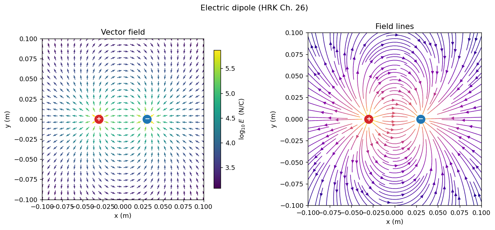

# Computational Electromagnetism

Python simulations built alongside a university electromagnetism course, following
**Halliday, Resnick & Krane, *Physics* Volume 2**. Each notebook takes one chapter and turns its
central equations into code — not to illustrate results that are already in the book, but to check
them numerically and then push past the cases that can be solved by hand.



## Contents

| Notebook | Chapter | Covers |
|---|---|---|
| [`ch26_electric_field.ipynb`](notebooks/ch26_electric_field.ipynb) | 26 — The Electric Field | `E = F/q0` (Eq. 26-3), field of a point charge (Eq. 26-6), `F = qE` (Eq. 26-4), superposition (Eq. 26-7), field maps and field lines, charge trajectories |

More chapters to follow — see [Roadmap](#roadmap).

## What the Ch. 26 notebook does

1. **The field does not depend on the test charge.** Four different values of `q0` are dropped at
   the same point; `F/q0` comes out identical each time, which is the claim the book makes
   immediately after Eq. 26-3.
2. **Inverse-square check.** A log–log fit of `E(r)` for a point charge returns a slope of
   `-2.0000`.
3. **Newton's third law with unequal charges.** With `q1 = 3 nC` and `q2 = -1 nC`, the two fields
   `E1` and `E2` differ by a factor of three, yet `F12 = -F21` — the point of Fig. 26-2.
4. **Superposition** for `N` charges, cross-validated against a direct term-by-term Coulomb sum.
5. **Field maps and field lines** for a single charge, a dipole, two like charges, and a
   quadrupole, with a root-find for the null point between like charges.
6. **Dynamics.** Electron trajectories through a dipole field integrated with `solve_ivp`, plus the
   uniform-field deflection case from the TV-tube entry in Table 26-1.
7. **Order-of-magnitude checks** against Table 26-1 — hydrogen at the Bohr radius comes out at
   `5.14e11 N/C` against the book's `5e11`.

## Installation

```bash
git clone https://github.com/<your-username>/computational-em.git
cd computational-em
python -m venv .venv
source .venv/bin/activate        # Windows: .venv\Scripts\activate
pip install -r requirements.txt
jupyter lab
```

## Using the module directly

The plotting and field routines live in [`src/efield.py`](src/efield.py) so they can be reused
outside the notebook:

```python
import sys; sys.path.insert(0, "src")
from efield import E_total, field_lines

charges = [(4e-9, (-0.03, 0.0)), (-4e-9, (0.03, 0.0))]   # (q in C, position in m)
field_lines(charges, title="Dipole")
```

A note on `soft`: `E_point` and `E_total` take a softening radius that freezes the field within a
small distance of each charge, purely so a grid point landing on a charge does not divide by zero.
It carries no physics. Keep it well below any length scale you care about, and pass something like
`soft=1e-9` for scalar evaluations such as root-finding.

## Tests

The test suite checks the physics rather than the plumbing — inverse-square behaviour, the third
law, superposition against a direct Coulomb sum, and agreement with Table 26-1.

```bash
pytest tests -v
```

## Roadmap

- [x] Ch. 26 — The electric field of point charges
- [ ] Ch. 26 §26-4/26-5 — Continuous distributions: charged rod, ring, and disc, integrated
      numerically and compared with the closed-form results
- [ ] Ch. 26 §26-6 — Dipole in an external field: torque and oscillation
- [ ] Ch. 27 — Gauss's law: integrate `E · dA` over a closed surface and check it against
      `q_enc / eps0`
- [ ] Ch. 28 — Electric potential and equipotential surfaces
- [ ] Ch. 32/33 — Magnetic fields and Faraday's law

## Conventions

- SI units throughout: coulombs, metres, newtons, N/C.
- Constants are CODATA 2018 values.
- Two-dimensional geometry; charges are given as `(q, (x, y))` tuples.

## References

Halliday, D., Resnick, R., & Krane, K. S. *Physics*, Volume 2 (5th ed.). Wiley.

## License

MIT — see [LICENSE](LICENSE).
